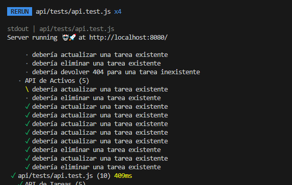
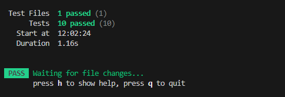
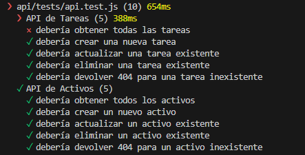
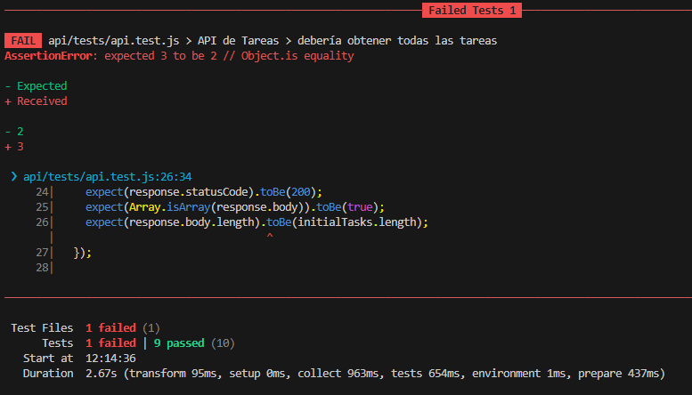

# Proyecto de Sprint 9 - Unit Testing

Este es el backend del proyecto Unit Testing, usando vitest en el modulo TEST.

## Tabla de Contenidos

- [Resumen](#resumen)
- [El desafío](#el-desafío)
- [Pantallazo](#pantallazo)
- [Mi proceso](#mi-proceso)
- [Tecnología utilizada](#tecnología-utilizada)
- [Lo que aprendí](#lo-que-aprendí)
- [Desarrollo a futuro](#desarrollo-a-futuro)
- [Recursos útiles](#recursos-útiles)
- [Autor](#autor)
- [Agradecimientos](#agradecimientos)

## Resumen

Para ejecutar este proyecto, sigue los siguientes pasos:

1. Clona el repositorio en tu máquina local.
2. Navega al directorio del proyecto.
3. Instala las dependencias ejecutando:
   ```bash
   npm install
   npm test
   ```

### El desafío

Los usuarios deben ser capaces de:

- ver como se realiza el test por su cuenta, haciendo las validaciones correspondientes en el metodo CRUD

### Pantallazo

Se tiene una vista de las actividades que recorre el sistema npm test, para ver con un check si todo salio bien o mal...



De darse todo bien, se tiene el resultado:



Por ejemplo, si mi estado inicial, coloco 2 TASKS en vez de 3 que hay en el script task.service.js, ahi me saldra un error.:



Al final me sale esto:
Esperaba ver 2 tasks pero en el estado inicial en el sccrip task.service.js hay definidos 3 tasks, este cambio lo hice en el archivo /tests/api.test.js, const initialTasks...



## Mi proceso

- Se utilizó el repositorio base dado por MIR, en donde se establecía los assets y task como script base y sus controladores,
- En las routes y los index de cada carpeta se verificó como eran los métodos CRUD tanto para assets y taks, viendo que el ID en task es un valor numerico y el id de Asset es una cadena string.
- En base a ello se realizó en una carpeta aparte "test" el api.test.js, donde se tiene las importaciones debidas y los métodos que esperamos se ejecute y que codigo de respuesta esperamos ver.

### Tecnología utilizada

- **Nodejs** Para la creación del servidor y la lógica del API.
- **Express** Para gestionar las rutas y el middleware.

### Lo que aprendí

Durante el desarrollo de este proyecto, aprendí a construir una API RESTful usando Node.js y Express, así como a gestionar rutas y middleware. También adquirí experiencia en la creación de pruebas automatizadas utilizando Jest y Supertest para garantizar que las funcionalidades del API funcionen correctamente. Algunas lecciones clave incluyen:

- **Estructura de Pruebas**: Cómo organizar las pruebas de manera efectiva, utilizando descripciones claras para cada caso.
- **Simulación de Solicitudes**: Uso de Supertest para simular solicitudes HTTP y verificar las respuestas del servidor.
- **Manejo de Errores**: Cómo manejar diferentes códigos de estado HTTP y responder apropiadamente en función del resultado de las operaciones.
- **Validación de Datos**: Importancia de validar los datos de entrada para asegurar que el API sea robusto y seguro.

A continuación, un fragmento de código destacado de una prueba:

```javascript
it("debería actualizar un activo existente", async () => {
  const updatedAsset = { name: "Activo Actualizado" };
  const response = await request(app)
    .patch(`/api/assets/1`) // Asegúrate de que el ID sea correcto
    .send(updatedAsset);

  expect(response.statusCode).toBe(200);
  expect(response.body.name).toBe(updatedAsset.name);
});
```

### Desarrollo a futuro

En futuros proyectos, planeo explorar más sobre la optimización de aplicaciones en Node.js, implementar autenticación y autorización, así como mejorar la estructura de las pruebas automatizadas.

### Recursos útiles

Documentación de Express

## Autor

- Github - [@Mikelyto1994](https://github.com/Mikelyto1994)

## Agradecimientos

Agradezco a los instructores del curso Make It Real por proporcionar un marco tan útil para este proyecto. Me basé en la carpeta para realizar los tests correspondientes.
